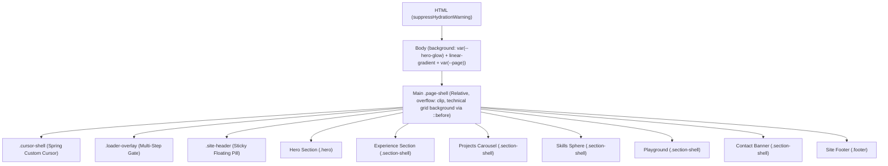

# Yashas Bajaj | Architecture & Design System Specification (`context.md`)

This document serves as the comprehensive technical reference for the design system, styling, layout metrics, typography, and interactive component structures of Yashas Bajaj's developer portfolio. It is designed to preserve architectural context for developers maintaining or expanding this codebase.

---

## 1. Typography & Hierarchy

The site uses three primary Google Fonts, imported via Next.js's optimized `next/font/google` loader, configured with CSS variable bindings for maximum styling speed and isolation:

| Variable | Font Family | Subsets | Weights | Usage & Context |
| :--- | :--- | :--- | :--- | :--- |
| `--font-heading` | **Cormorant Garamond** | `latin` | `400, 500, 600, 700` | Elegant serif family used for prominent headings, section titles, card headers, and brand elements with a tight `-0.065em` tracking on the hero display. |
| `--font-mono` | **IBM Plex Mono** | `latin` | `400, 500, 600` | High-readability technical monospace used for kicker labels, metadata indicators, terminal code blocks, interactive buttons, and trigger states. |
| `--font-body` | **Manrope** | `latin` | `400, 500, 600, 700` | Modern, clean geometric sans-serif acting as the core reading canvas for body copy, lists, and descriptive paragraphs. |

---

## 2. Color Theme & Variables System

The styling is built completely on vanilla CSS variables (`app/globals.css`), providing a robust theme wrapper. The project implements a dual-theme toggle (Dark/Light). An inline theme-initialization script in `app/layout.tsx` blocks flash-of-unstyled-content (FOUC) by checking `localStorage` or fallback system preferences before rendering the page shell.

### 2.1 CSS Custom Properties (Theme Tokens)

```css
/* ==========================================================================
   DARK THEME (Default Canvas Mode - Obsidian Dark)
   ========================================================================== */
:root {
  --obsidian: #0d0e10;
  --white: #f3f4f6;
  --muted-gray: #9ca3af;
  --page: #0d0e10;                          /* Deep dark canvas background */
  --text: #f3f4f6;                          /* High-contrast off-white text */
  --text-soft: rgba(243, 244, 246, 0.72);   /* High-readability body copy */
  --text-faint: rgba(243, 244, 246, 0.46);  /* Sub-labels and disabled states */
  --line: rgba(243, 244, 246, 0.11);        /* Subtle utility borders */
  --line-strong: rgba(243, 244, 246, 0.22); /* Focus outlines, highlighted dividers */
  --surface: rgba(255, 255, 255, 0.035);    /* Semitransparent card backdrops */
  --surface-strong: rgba(255, 255, 255, 0.068);
  --shadow: 0 34px 90px rgba(0, 0, 0, 0.28);/* Deep, floating volumetric shadows */
  --grid-line: rgba(243, 244, 246, 0.045);  /* Faint technical grid background lines */
  --header-bg: rgba(13, 14, 16, 0.8);       /* Sticky pill backdrop */
  --construction-bg: rgba(7, 8, 10, 0.86);
  
  /* Radial dynamic page glows */
  --hero-glow:
    radial-gradient(circle at 14% 18%, rgba(73, 197, 141, 0.07), transparent 26%),
    radial-gradient(circle at 88% 14%, rgba(210, 165, 109, 0.11), transparent 22%),
    radial-gradient(circle at 76% 64%, rgba(124, 174, 196, 0.09), transparent 24%);

  /* Section Layout Metrics */
  --max-width: 1180px;
  --gutter: clamp(1rem, 3vw, 2rem);
  --section-space: clamp(4.5rem, 8vw, 7.5rem);

  /* Unified Functional Colors */
  --accent-emerald: #49c58d;   /* Consultations, green status indicators */
  --accent-amber: #d2a56d;     /* Technical specifications, resume */
  --accent-cyan: #7caec4;      /* Systems/infrastructure timeline */
  --accent-rose: #d69a92;      /* Full-stack platform timeline */
}

/* ==========================================================================
   LIGHT THEME (Warm Cream Canvas Mode)
   ========================================================================== */
:root[data-theme="light"] {
  --page: #f4efe5;                          /* Smooth warm white/cream background */
  --text: #111419;                          /* High-contrast charcoal text */
  --text-soft: rgba(17, 20, 25, 0.72);      /* Highly legible dark body copy */
  --text-faint: rgba(17, 20, 25, 0.48);
  --line: rgba(17, 20, 25, 0.12);           /* Warm hairline borders */
  --line-strong: rgba(17, 20, 25, 0.24);
  --surface: rgba(255, 255, 255, 0.46);     /* Semi-reflective glassy plates */
  --surface-strong: rgba(255, 255, 255, 0.78);
  --shadow: 0 28px 64px rgba(17, 20, 25, 0.08);
  --grid-line: rgba(17, 20, 25, 0.045);
  --header-bg: rgba(244, 239, 229, 0.78);
  --construction-bg: rgba(244, 239, 229, 0.88);
  
  --hero-glow:
    radial-gradient(circle at 14% 18%, rgba(73, 197, 141, 0.06), transparent 26%),
    radial-gradient(circle at 88% 14%, rgba(210, 165, 109, 0.09), transparent 22%),
    radial-gradient(circle at 76% 64%, rgba(124, 174, 196, 0.08), transparent 24%);
}
```

---

## 3. Site Shell & Global Layout Structure

The layout uses a modular, component-driven architecture designed to be responsive, high-performance, and micro-animated.



### 3.1 Global Elements & Page Background
- **The Page Grid Mask (`.page-shell::before`):** Creates an elegant overlay using CSS grid patterns. It uses a fixed `72px 72px` box size constructed from `var(--grid-line)` and is masked with a smooth radial gradient that fades out to the sides (`mask-image: radial-gradient(circle at center, black 26%, transparent 78%)`). This restricts the technical lines to a concentrated, atmospheric circular center.
- **Scroll Behavior:** Configured globally as `scroll-behavior: smooth`, except when users enable OS-level reduced motion overrides (`@media (prefers-reduced-motion: reduce)`), which defaults all transitions and transforms to `0.01ms` duration.
- **Brand Monograms**: Brand images (`/yb-logo-light.png` and `/yb-logo-dark.png`) are truly transparent, gridless monogram favicons loaded using cache-busting queries (`?v=3`) inside `site-header.tsx`. They switch dynamically between dark (silver YB) and light (black YB) modes.

---

## 4. Component-Level Structures

Below are the detailed component markup skeletons, highlighting how the classes fit together to establish layouts:

### 4.1 Site Floating Navigation Header (`site-header.tsx`)

A floating glassmorphic container centered at the top of the viewport.

```html
<header class="site-header">
  <div class="site-header-inner">
    <!-- Brand Logo Toggles depending on active theme -->
    <a href="#top" class="site-brand" data-cursor="Home">
      <div class="site-brand-logo">
        
        
      </div>
    </a>

    <!-- Nav Links (hidden on mobile <= 760px) -->
    <nav class="site-nav" aria-label="Primary navigation">
      <a href="#experience" class="site-nav-link" data-cursor="Experience">
        Experience
        <span class="site-nav-underline"></span>
      </a>
      <a href="#projects" class="site-nav-link" data-cursor="Projects">
        Projects
        <span class="site-nav-underline"></span>
      </a>
      <a href="#tools" class="site-nav-link" data-cursor="Tools">
        Tools
        <span class="site-nav-underline"></span>
      </a>
      <a href="#playground" class="site-nav-link" data-cursor="Playground">
        Playground
        <span class="site-nav-underline"></span>
      </a>
    </nav>

    <!-- Header Operations -->
    <div class="site-actions">
      <button class="theme-toggle" aria-label="Toggle visual theme" data-cursor="Toggle">
        <!-- Sun/Moon icons dynamically rendered -->
      </button>
    </div>
  </div>
</header>
```

### 4.2 Hero Section (`hero.tsx`)

The initial viewport block featuring particle integrations, dark dynamic overlays, and typographic content. The 3D canvas is shifted off-center right by `translateX(clamp(2rem, 15vw, 16rem))` in desktop viewports.

```html
<section class="hero" id="top">
  <div class="hero-canvas"><canvas></canvas></div>
  <div class="hero-backdrop"></div>

  <div class="section-shell hero-content">
    <div class="hero-copy">
      <!-- massive high-contrast Editorial Serif title -->
      <h1 class="hero-title">Yashas Bajaj</h1>
      
      <!-- sharp iron-gray Monospace sub-headline -->
      <p class="hero-subtitle">Full-Stack Architect & Systems Engineer</p>
      
      <!-- justified, pretty-wrapped body-copy -->
      <p class="hero-ethos">Engineering resilient infrastructure...</p>
      
      <!-- interactive monospaced CTA triggers -->
      <div class="hero-actions hero-actions-raw">
        <a class="hero-trigger hero-trigger-emerald" href="#contact">[ INITIATE_CONSULTATION ]</a>
        <a class="hero-trigger hero-trigger-amber" href="/under-construction">[ VIEW_TECHNICAL_SPEC ]</a>
      </div>
    </div>
  </div>

  <div class="hero-location-corner">
    <span>SYS_LOC // NEW DELHI_INDIA</span>
  </div>
</section>
```

### 4.3 Experience Section Timeline (`experience-section.tsx` & `timeline-beam.tsx`)

Uses Framer Motion to tie a central multi-colored gradient rail's scale (`scaleY`) to the container’s viewport entry:

```html
<div class="timeline-shell">
  <!-- Interactive scrolling track -->
  <div class="timeline-rail">
    <div class="timeline-rail-active"></div>
  </div>

  <!-- Job Entry Block -->
  <article class="timeline-entry" style="--entry-accent: var(--accent-rose)">
    <!-- floating dot centered on the active rail -->
    <div class="timeline-dot"></div>
    
    <!-- sticky metadata sidebar (shifts inline on mobile) -->
    <div class="timeline-sticky">
      <span class="meta">October 2024 - July 2025</span>
      <h3 class="timeline-company"><a href="https://linkedin.com/... " target="_blank">[COMPANY_NAME]</a></h3>
      <p class="timeline-role">Software Developer Intern</p>
    </div>
    
    <!-- descriptive details container card -->
    <div class="timeline-card">
      <p class="timeline-summary">Security and infrastructure work...</p>
      <ul class="timeline-list">
        <li>↳ Designed S3-based caching...</li>
      </ul>
    </div>
  </article>
</div>
```

### 4.4 Projects Carousel (`projects-section.tsx`)

A horizontally-oriented, mathematically-driven infinite circular loop. All cards are mounted in the DOM to avoid loading animations. It slides cards smoothly utilizing Framer Motion transforms and scrolls smoothly with delta and wheel throttle boundaries.

```html
<div class="kinetic-carousel">
  <button class="carousel-nav carousel-nav-left">[ PREV ]</button>
  <div class="kinetic-stage">
    <!-- Active, side, and hidden cards positions computed in real-time -->
    <article class="kinetic-card" style="--project-accent: var(--accent-cyan)">
      <div class="kinetic-card-body">
        <span class="meta">Expense platform</span>
        <h3 class="kinetic-card-title">BATWARA</h3>
        <p class="kinetic-card-copy">Modular monolith...</p>
        <div class="kinetic-card-actions">
          <a class="kinetic-trigger" href="...">[ LIVE_DEPLOY ]</a>
          <a class="kinetic-trigger" href="...">[ SRC_CODE ]</a>
          <a class="kinetic-trigger" href="/under-construction">[ SYS_DOCS ]</a>
        </div>
      </div>
    </article>
  </div>
  <button class="carousel-nav carousel-nav-right">[ NEXT ]</button>
</div>
```

### 4.5 Interactive Skill Orbit Sphere (`skills-section.tsx`)

A 3D coordinate sphere that sorts nodes by dynamic depths (`zIndex`) and tracks client mouse events to rotate.

```html
<div class="tools-layout">
  <div class="icon-sphere">
    <div class="icon-sphere-glow"></div>
    <div class="icon-orbit-node" style="transform: translate3d(x, y, 0) scale(s); opacity: o; z-index: z;">
      <svg></svg>
      <span>TypeScript</span>
    </div>
  </div>
  <div class="tools-panel-grid">
    <article class="tools-panel">
      <span class="tools-panel-title">Backend</span>
      <p>REST APIs, auth flows, migrations...</p>
    </article>
  </div>
</div>
```

### 4.6 Playground Webcam Grid with Manual Kill Switch (`playground-section.tsx`)

Integrates the official Aceternity `WebcamPixelGrid` component in a premium, responsive `.webcam-grid-card` container featuring a manually controlled active state trigger mechanism:

```html
<div class="playground-layout playground-balanced">
  <div class="playground-column">
    
    <!-- Wrapped Aceternity Webcam component card featuring manual switches -->
    <div class="webcam-grid-card">
      <div class="snake-header">
        <div>
          <p class="meta">Optional live mode</p>
          <h3 class="snake-title">Webcam pixel grid</h3>
        </div>
        <div class="flex gap-2">
          <!-- Controls unmount the component reactively to terminate hardware streams -->
          <button class="section-inline-button">[ ENABLE ]</button>
          <button class="section-inline-button">[ KILL_SWITCH ]</button>
        </div>
      </div>
      <p class="playground-copy">Camera access is optional...</p>
      
      <!-- Video parsing stage - Enlarged display box (Height: 360px) -->
      <div class="relative w-full rounded-xl overflow-hidden bg-black/40 border mt-4" style="height: 360px;">
        <!-- Rendered WebGL canvas feed when cameraActive is true -->
        <!-- Fallback [ WEBCAM_FEED_KILLED ] placeholder when cameraActive is false -->
      </div>
    </div>

    <!-- Rickroll damage panel -->
    <div class="playground-card playground-rickroll-card">
      <p class="meta">Do not click</p>
      <button class="tempt-button">[ FREE_PERFORMANCE_PATCH ]</button>
    </div>
  </div>

  <div class="playground-column">
    <!-- Snake Game Block -->
  </div>
</div>
```

### 4.7 Floating Dynamic Cursor Portal (`custom-cursor.tsx`)

A high-performance custom pointer interface that follows the user's cursor with spring-damping physics, expanding to encase links or utility labels:

```html
<!-- Visible only on fine pointer devices (pointer: fine) -->
<div class="cursor-shell cursor-shell-visible">
  <!-- Outer ring that expands, morphs and scales behind elements with data-cursor attributes -->
  <div class="cursor-ring cursor-ring-active" style="transform: translate3d(x, y, 0); width: w; height: h; border-radius: r;"></div>
  
  <!-- Central focus point tracker -->
  <div class="cursor-dot" style="transform: translate3d(x, y, 0) translate(-50%, -50%);"></div>
  
  <!-- Monospaced hovering dynamic label -->
  <div class="cursor-tooltip" style="transform: translate3d(x, y, 0);">[VIEW]</div>
</div>
```

### 4.8 Under Construction Page Spring Cursor (`app/under-construction/page.tsx`)

Features active `<CustomCursor />` rendering to ensure high-fidelity physics-based mouse snapping and brackets tracking are fully functional even outside the main canvas routing:

```html
<>
  <CustomCursor />
  <main class="construction-page">
    <div class="construction-card">
      <span class="meta">System loading error</span>
      <h1 class="construction-title">Page under construction.</h1>
      
      <!-- Returns cleanly to home page "/" -->
      <a href="/" class="section-inline-button" data-cursor="Return">
        [ RETURN_HOME ]
      </a>
    </div>
  </main>
</>
```

---

## 5. Visual Mechanics & Transitions Reference

- **Custom Cursor Snapping:**
  When hovering over elements containing the `data-cursor="[Label]"` attribute, the custom cursor outer ring expands utilizing spring-physics, snapping to the target element's bounding box and displaying the brackets `[LABEL]` offset at `45-degrees` from the central dot. Snapping is dynamically isolated and bypassed inside the sticky floating navbar (`.site-header`) to maintain high editorial aesthetic boundaries.
- **Active Structural States:**
  Active highlights, underlines, input focuses, dynamic tab states, and custom snapped cursor borders use **Cyan (`var(--accent-cyan)` or `#7caec4`)** as the core interaction indicator for dark mode and light mode, retaining the classic tech aesthetic.
